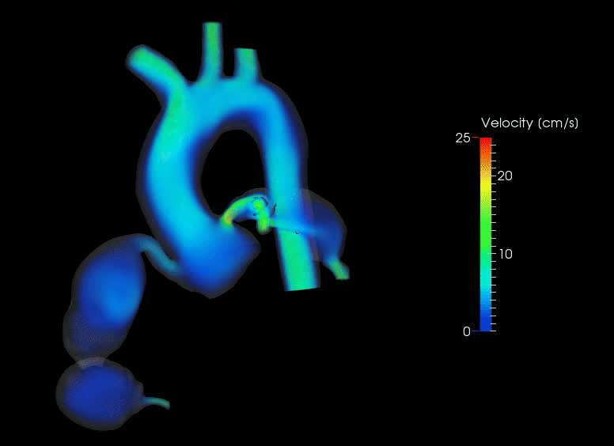

# Cardiovascular Fluid Mechanics

| Category              | Details           |
|-----------------------|-------------------|
| 👥 Appropriate Audience | Grades 8-11  |
| ⏱️ Lesson Time          | 20-30 minutes|
| 👨‍🎓 Number of Students   | 10 to 25     |
| 💻 Computer Use          | ❌          |
| 🖨️ Printable Material    | ❌          |

---

## Lesson Overview
This lesson covers topics in fluid mechanics and how it is applied to understand cardiovascular diseases. There is no interactive exercise for this lesson yet.

---

## Lesson structure
**Before session**
- review subject matter in powerpoint lesson

**During session**
- PowerPoint presentation (15-20 minutes)
- Wrap-up (5 minutes)

---

## Files

### Lesson powerpoint

<a href="https://docs.google.com/presentation/d/1tTBIJjanU67Rzu2Tk1iIvBwd2evu53FH/edit?usp=sharing&ouid=118083458277764683959&rtpof=true&sd=true" download>Download slides</a>

<iframe src="https://docs.google.com/viewer?url=https://raw.githubusercontent.com/biomechday/biomechday.github.io/main/book/Cardiovascular/Fluid%20Mechanics/lesson.pdf&amp;embedded=true" width="800" height="450" style="border:none;"></iframe>
