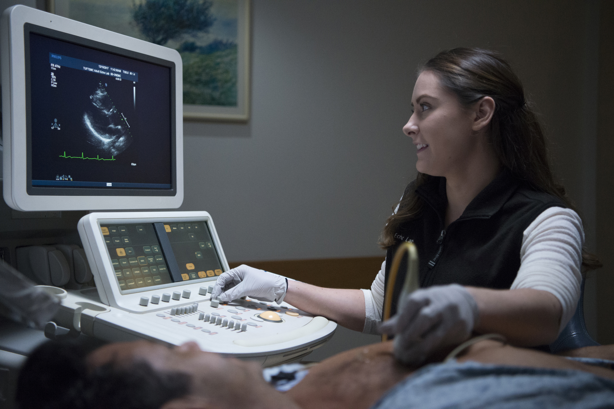

# Medical Imaging

| Category              | Details           |
|-----------------------|-------------------|
| 👥 Appropriate Audience | Grades 8-12  |
| ⏱️ Lesson Time          | 1 hour       |
| 👨‍🎓 Number of Students   | 10 to 20     |
| 💻 Computer Use          | ✅          |

---

## Lesson Overview
This lesson covers topics in medical imaging methods, with a focus on cardiovascular applications. Specifically, it focuses on X-Ray, CT, ultrasound, and MRI. After a brief powerpoint lesson, an interactive computer session is followed in which students an open-source software to build models of blood vessels using MRI images.

It starts with a 15-20 minute powerpoint lesson that covers the aforementioned topics, followed by a guided exercise to build 3D computer models of the descending aorta and iliac arteries. It is the instructor's responsibility to guide the students through this process. 

The computer exercise requires access to Windows or Mac computers, ideally with windows 10 software or newer. A free, open source software called **SimVascular** is required for the exercise. The exercise files are linked on this page.

---

## Lesson structure
**Before session**
- download SimVascular software & prepare computers with exercise files
  - note that downloading this software can be convoluted. we are happy to help making this process simpler, simply reach out to us via biomechday@andrew.cmu.edu! 

**During session**
- PowerPoint presentation (15-20 minutes)
- Computer setup (5–10 minutes)
- Interactive computer session (30–45 minutes)
- Wrap-up (5 minutes)

---

## Computer requirements

| Category              | Details           |
|-----------------------|-------------------|
| Operating System | Windows 10 or newer, MacOS 11 or newer   |
| Storage          | 64 GB or greater                         |
| RAM              | 8 GB, ideally 16+ GB                     |
| Software         | [SimVascular](https://simtk.org/frs/?group_id=188) (December 2025, or May 2023 versions). Older versions work best for older computers|

---

## Files

### Lesson Plan
<a href="https://raw.githubusercontent.com/biomechday/biomechday.github.io/main/book/Cardiovascular/Medical%20Imaging/lesson_plan.pdf" download>Download lesson plan</a>

<iframe src="https://docs.google.com/viewer?url=https://raw.githubusercontent.com/biomechday/biomechday.github.io/main/book/Cardiovascular/Medical%20Imaging/lesson_plan.pdf&amp;embedded=true" width="800" height="450" style="border:none;"></iframe>

---

### Lesson Slides
<a href="https://docs.google.com/presentation/d/16DzN8e2NHjo_x3ZFZYo4_kY-blH28K_9/edit?usp=drive_link&ouid=118083458277764683959&rtpof=true&sd=true" download>Download slides</a>

<iframe src="https://docs.google.com/viewer?url=https://raw.githubusercontent.com/biomechday/biomechday.github.io/main/book/Cardiovascular/Medical%20Imaging/imaging.pdf&amp;embedded=true" width="800" height="450" style="border:none;"></iframe>

---

### Imaging Tutorial Files
<a href="https://raw.githubusercontent.com/biomechday/biomechday.github.io/main/book/Cardiovascular/Medical%20Imaging/imaging-exercise.pptx" download>Download SimVascular tutorial</a>

<iframe src="https://docs.google.com/viewer?url=https://raw.githubusercontent.com/biomechday/biomechday.github.io/main/book/Cardiovascular/Medical%20Imaging/imaging-exercise.pdf&amp;embedded=true" width="800" height="450" style="border:none;"></iframe>

---
