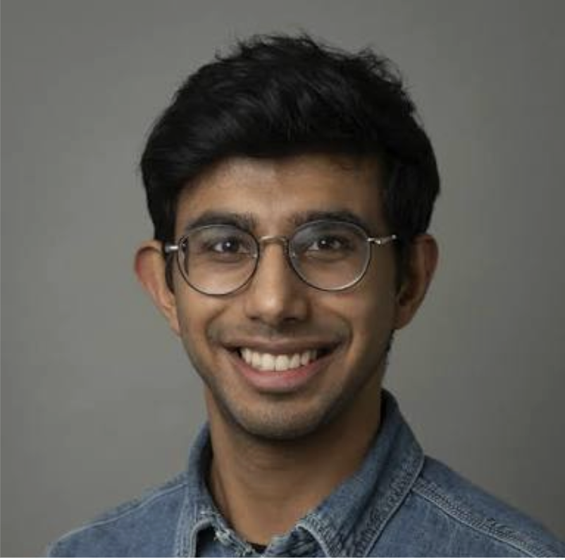
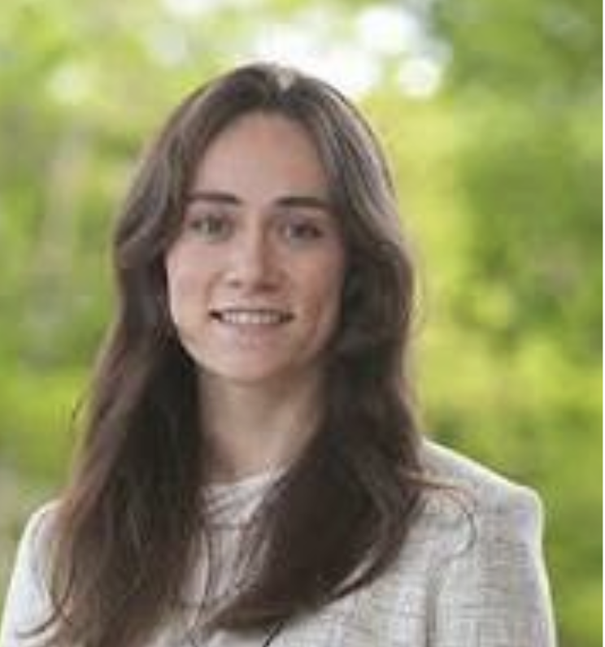
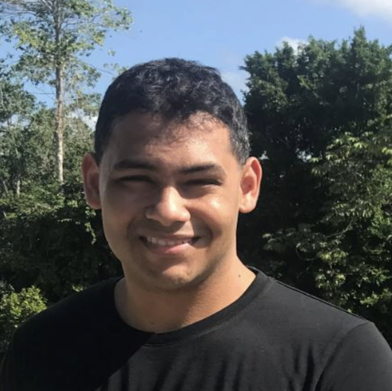
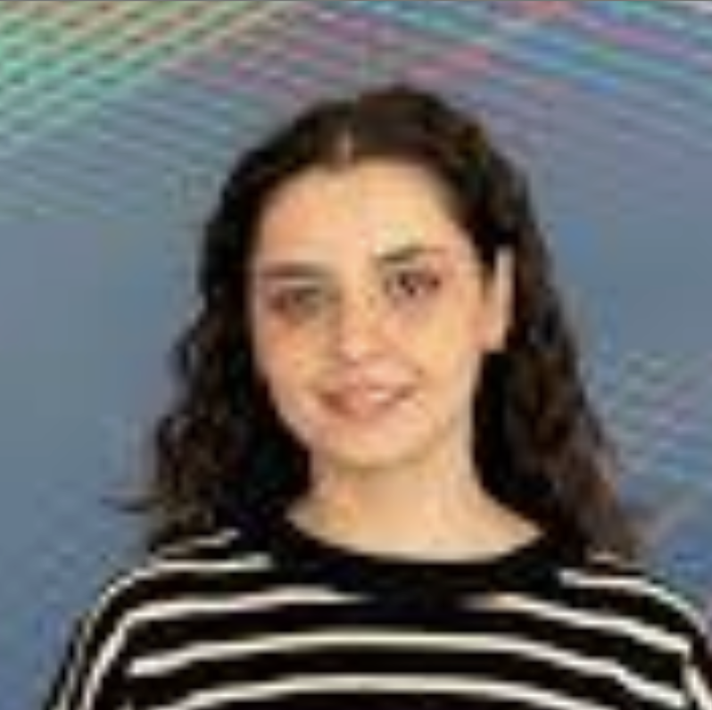
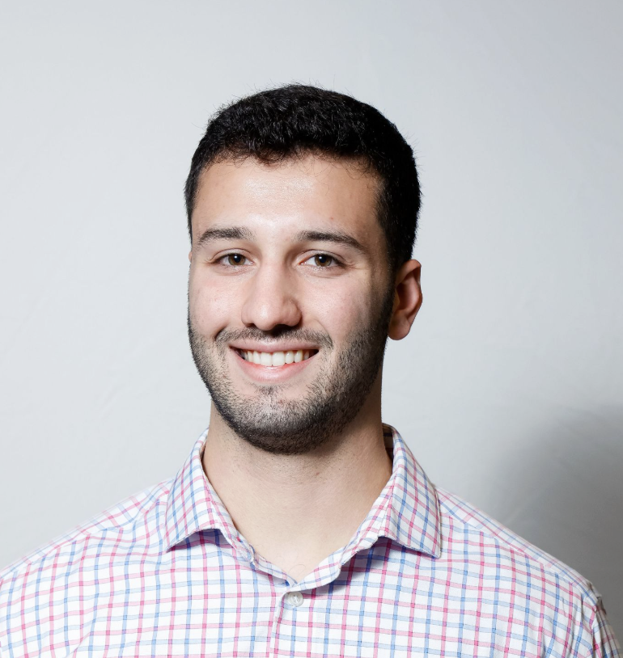
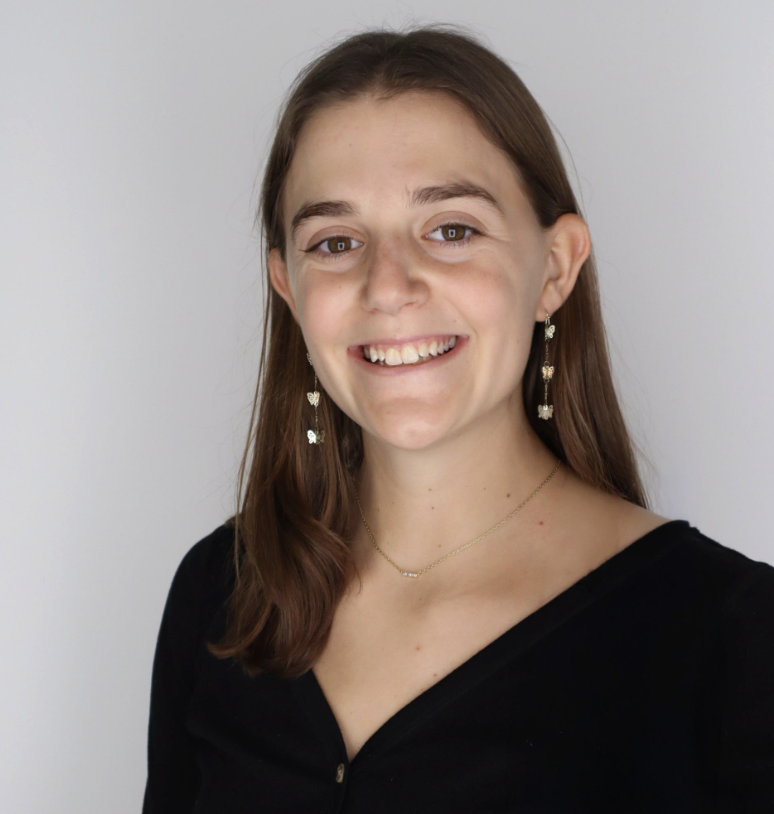

# Board & Faculty

National Biomechanics Day at CMU is organized by students with support from faculty and community partners. This page is the place to keep the current leadership team and faculty advisors up to date.

## Student board

Our current board members are pictured below. Photos are listed in the order provided by the NBD team.

|  |  |  |
|---|---|---|
|  |  |  |
| **Arnav Garcha** | **Anna Iacocca** | **Faeze Jahani** |
|  |  |  |
| **Ravesh Sukhnandan** | **Jon Ibinson** | **Maria Tagliaferri** |

## Faculty and advisors

| Role | Name | Department or affiliation |
|---|---|---|
| Faculty Advisor | _Add name_ | _Add department_ |
| Faculty Advisor | _Add name_ | _Add department_ |

Interested in joining the team, supporting an event, or collaborating on an outreach activity? Contact [biomechday@andrew.cmu.edu](mailto:biomechday@andrew.cmu.edu).