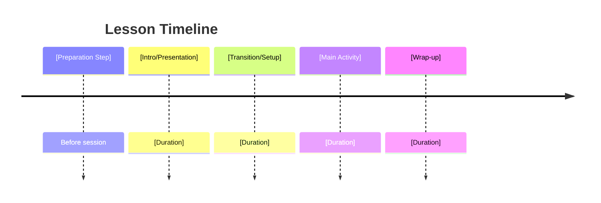

# [Lesson Title]

| Category              | Details           |
|-----------------------|-------------------|
| 👥 Appropriate Audience | [Grade Level or Audience] |
| ⏱️ Lesson Time          | [Duration] |
| 👨‍🎓 Number of Students   | [Range] |
| 🛠️ Hands-on Exercises    | [Yes/No] |
| 💻 Computer Use          | [Yes/No] |
| 📦 Physical Material     | [Yes/No] |
| 🖨️ Printable Material    | [Yes/No] |
| 🏗️ CAD Files Required     | [Yes/No] |
| 🛒 Materials to Purchase  | [Yes/No] |

---

## Lesson Overview
[Brief description of the lesson, objectives, and learning outcomes.]

---

## Lesson Structure

---

## Computer Requirements (if applicable)

| Category              | Details           |
|-----------------------|-------------------|
| Operating System | [OS requirements] |
| Storage          | [Minimum storage] |
| RAM              | [Minimum RAM] |
| Software         | [Required software, e.g., CAD tools, simulation software] |

---

## Hands-on Materials (if applicable)
| Item                | Quantity | Estimated Cost |
|---------------------|----------|---------------|
| [Material Name]     | [Qty]    | [$] |
| [Material Name]     | [Qty]    | [$] |

---

## CAD Files (if applicable)
- [Link to download CAD files]
- [Embed viewer iframe for CAD previews]

---

## Files

### Lesson Slides
[Link to download slides]

[Embed viewer iframe for slides]

---

### Tutorial Files
[Link to download tutorial files]

---

### Software Instructions
[Link to download instructions]

[Embed viewer iframe for instructions]

---

### Printable Worksheets
[Link to download worksheets]

[Embed viewer iframe for worksheets]
``
